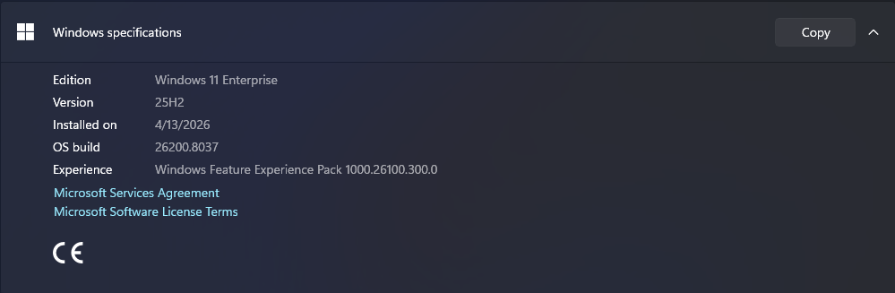
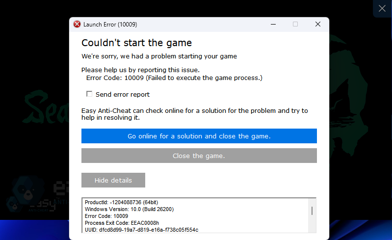
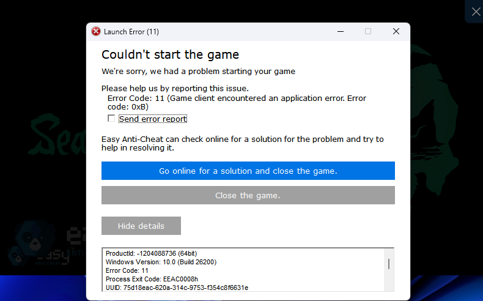
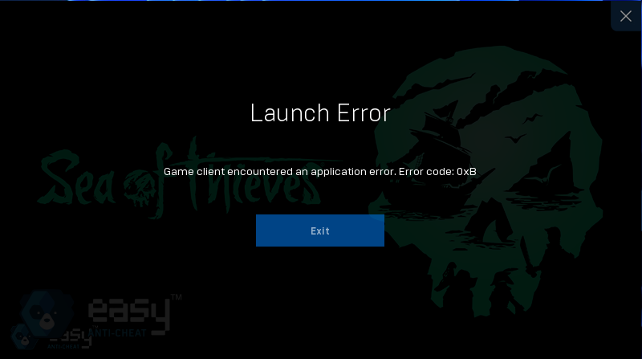
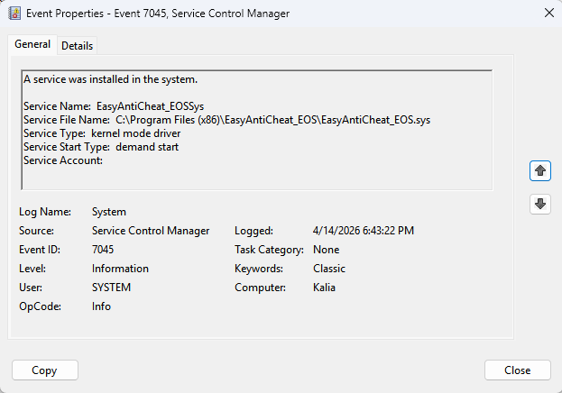
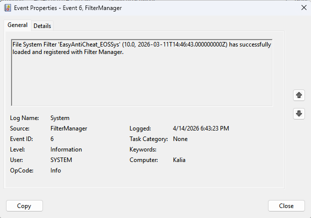
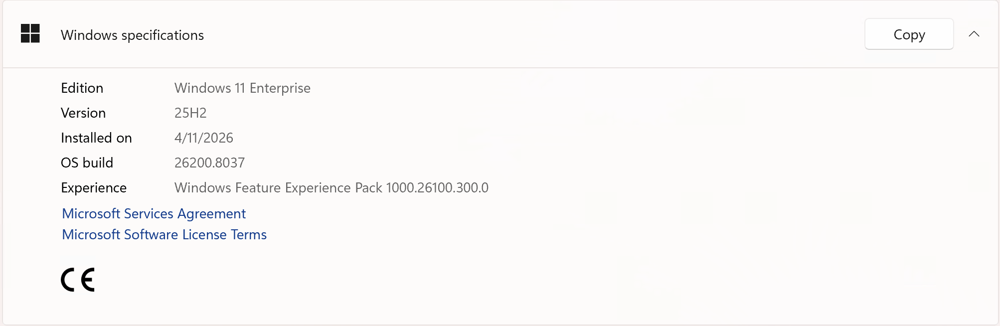

# Sea of Thieves - Windows 11 Insider Canary EAC Crash & Fix

A comprehensive technical breakdown and PowerShell automation script to bypass the Easy Anti-Cheat (EAC) kernel crash for *Sea of Thieves* on Windows 11 Insider Canary builds. This solution utilizes a temporary, automated firewall block to achieve a "fail-open" initialization, allowing the game to launch safely without dropping remote desktop connections.

## 🐛 The Issue: The Insider Environment Crash
If you have been running a long-standing Windows 11 Insider build (such as Version 25H2 OS build 26200.8037), *Sea of Thieves* may immediately hard crash upon launch. 



You may see various Easy Anti-Cheat error dialogs **(Don't worry if the exact error code changes, the root cause is the same)**:
* **"Error Code: 10009 (Failed to execute the game process.)"**
* **"Error Code: 11 (Game client encountered an application error. Error code: 0xB)"**
* **"Game client encountered an application error."**

**Error Examples:**





**The Technical Root Cause:**
Easy Anti-Cheat (EAC) operates as a Ring-0 kernel-mode driver (`EasyAntiCheat_EOS.sys`). In certain Windows Insider environments, systemic conflicts (such as telemetry hooks, Virtualization-Based Security (VBS), or registry cruft) cause EAC's network initialization to hang. 

Instead of triggering a Blue Screen of Death (BSOD), the `EasyAntiCheat_EOSSys` driver safely unloads itself from the Filter Manager during the network handshake. *Sea of Thieves* detects that the anti-cheat driver is missing and instantly terminates the process.

## 🔬 The Diagnostic Journey
Initial attempts to fix this by reinstalling the game via the Microsoft Store and Xbox App failed, repeatedly getting stuck at 17.64GB downloaded. *(Note: This specific Microsoft Store download bug appears to have recently been resolved by a minor Windows KB cumulative update).* 

To isolate the issue and definitively prove it was a localized OS environment failure rather than corrupted game files, we ran diagnostics:

1. **The Event Viewer Proof:** By checking `eventvwr.msc` immediately after a crash, the System logs showed Event ID 6 and Event ID 7045. These logs confirmed that the `EasyAntiCheat_EOSSys` driver was successfully injecting but then actively unloading itself right before the `.exe` crash.

   
   

2. **The Environment Control Test:** To rule out corrupted game files, a Native VHDX partition was built, and a fresh, clean install of Windows 11 was booted via an ISO. We pointed it at the exact same 128GB game files, and **it launched flawlessly.** 

   The twist? That "fresh" install actually had the **exact same** Windows Version (25H2 OS build 26200.8037) and Experience Pack as the broken Insider build:
   
   
   
   This proved the crash wasn't hard-locked to the Windows build number itself. Instead, the crash was caused by the *state* of the long-standing Insider environment. Regardless of the exact conflict, the firewall bypass script works perfectly to bypass it.

## 🚧 The Engineering Roadblocks
Creating an automated bypass required navigating several technical constraints:

* **The Remote Access Disconnect:** The initial workaround involved disabling the physical network adapter to force an offline launch. However, this instantly severed active remote streams (Moonlight, Twingate, Tailscale, Sunshine). The solution was pivoting to a precise Windows Defender Firewall block.
* **The UWP Shell Routing Failure:** Attempting to launch the Microsoft Store (UWP) app programmatically via its Package Family Name (`shell:AppsFolder\...`) caused Windows to unpredictably open File Explorer instead. The solution was targeting the direct executable path (`SeaOfThieves.exe`) to bypass the restrictive Explorer shell.
* **The "Fail-Close" Anti-Cheat Trap:** Modern anti-cheats use a "fail-close" architecture. If EAC is permanently blocked from the Epic Online Services backend, it cannot generate a secure trust token, and Xbox Live matchmaking servers will instantly reject the connection. The solution required precision timing: allowing a temporary offline state to bypass the kernel check, then instantly restoring the connection for the server handshake.

## 🛠️ The Fix: "Fail-Open" Network Isolation
We cannot modify the Windows kernel or the EAC driver, but we can manipulate the initialization sequence. If EAC cannot reach the backend to verify the kernel signature, it "fails open" and allows the game engine to reach the main menu. 

**How the script works:**
1. Wraps a strict inbound/outbound Windows Defender Firewall block specifically around `SeaOfThieves.exe`.
2. Launches the game directly via the `.exe`.
3. Waits exactly 30 seconds for the game engine to initialize and bypass the local kernel signature check.
4. Removes the firewall rules, restoring internet access to the game just in time for Xbox Live authentication and multiplayer matchmaking.

## 🚀 Installation & Usage

### Step 1: Save the Script
1. Download the `SoT-EAC-Bypass.ps1` script from this repository and **place it directly on your Desktop**.
2. Open the file in your preferred editor (like Notepad).
3. **Important:** Update the `$exePath` variable at the top of the script to match the exact location of your `SeaOfThieves.exe` file. (Example: `C:\XboxGames\Sea of Thieves\Content\SeaOfThieves.exe`)

> **Note:** The script has been provided as a standalone executable in this repo for ease of use.

### Step 2: Create a 1-Click Launch Shortcut
Because this script modifies the Windows Firewall, it requires Administrator privileges. To avoid opening an Admin terminal every time you want to play, create a desktop shortcut.

1. Right-click your Desktop > **New** > **Shortcut**.
2. In the location box, paste the following command (Since we placed the file on the Desktop, just change `YOUR_USERNAME` to your actual Windows username):
   ```cmd
   powershell.exe -ExecutionPolicy Bypass -WindowStyle Normal -Command "Start-Process powershell -ArgumentList '-ExecutionPolicy Bypass -File C:\Users\YOUR_USERNAME\Desktop\SoT-EAC-Bypass.ps1' -Verb RunAs"
   ```
3. Click **Next**, name the shortcut `Launch Sea of Thieves`, and click **Finish**.

### Step 3: Play
Double-click your new shortcut. Click "Yes" on the Admin prompt. The script will open a terminal, block the connection for the executable, launch the game, and automatically reconnect you to the servers 30 seconds later without dropping any remote desktop streams.

## 💖 Support the Project
If this project helped you resolve the Easy Anti-Cheat crash and you would like to support my work, you can do so via the link below.

[](https://paypal.me/AllaodeenTariq)

## ⚠️ Disclaimer
This script does not disable or modify Easy Anti-Cheat; it only delays its network handshake. Use this at your own risk. Playing online multiplayer games on unsupported, experimental Windows Insider kernels may result in unexpected disconnects or account flags by automated anti-cheat systems.